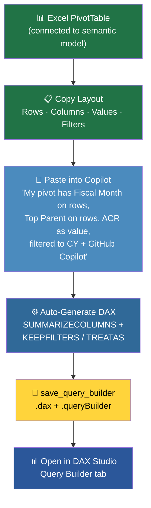

# dax-query-mcp

`dax-query-mcp` is a Windows-first Python package and MCP server for running DAX and metadata queries against Power BI / Analysis Services semantic models.

It supports:

- a CLI for running configured queries
- a first-class query-builder save flow for `.dax` + `.dax.queryBuilder`
- a connection-centric MCP server for AI clients
- optional markdown context files per connection

## Requirements

- Windows
- `MSOLAP` / Analysis Services client libraries installed
- Python 3.12+
- `uv`

If the provider is missing, runtime errors will point users to the Microsoft client library install page.

## Install

```bash
uv sync
```

Optional sanity check:

```bash
uv run dax-query --help
```

## Connection-centric MCP setup

Store semantic model connections in `Connections\`.

```text
Connections/
├── sample_connection.yaml
└── sample_connection.md
```

```yaml
# Connections/sample_connection.yaml
connection_string: |
  Provider=MSOLAP.8;
  Data Source=powerbi://api.powerbi.com/v1.0/myorg/SampleWorkspace?readonly;
  Initial Catalog=SampleSemanticModel

description: "Sample semantic model connection"
# Optional MCP workflow hint
# suggested_skill: "enrollment-skills"
# suggested_skill_reason: "Use this when you want help drafting KQL against canonical enrollment data."
command_timeout_seconds: 1800
```

```md
# Connections/sample_connection.md

Document important tables, measures, naming conventions, and business context here.
```

### MCP tools

- `list_connections`
- `get_connection_context`
- `run_connection_query`
- `run_connection_query_markdown`
- `inspect_connection`
- `get_query_builder_schema`
- `save_query_builder`
- `get_query_builder`

The bundled `sample_connection` scaffold stays in the repo for reference, but it is hidden from normal MCP connection listings so only your real connections show up.

If a connection YAML includes `suggested_skill` and `suggested_skill_reason`, both `list_connections` and `get_connection_context` will surface that hint so an MCP client can steer the user toward the right workflow.

The query and metadata MCP tools also return a `presentation_hint` plus a `markdown_table` preview so Copilot-style clients can default to rendering result previews as markdown tables.

### Local MCP config example

```json
{
  "mcpServers": {
    "dax-query-server": {
      "command": "uvx",
      "args": [
        "--refresh-package",
        "dax-query-mcp",
        "--from",
        "C:\\absolute\\path\\to\\dax-query-mcp",
        "dax-query-server"
      ],
      "env": {
        "DAX_QUERY_MCP_CONNECTIONS_DIR": "C:\\absolute\\path\\to\\dax-query-mcp\\Connections"
      }
    }
  }
}
```

Using `--refresh-package dax-query-mcp` is recommended for local-path MCP development so `uvx` does not keep serving a stale cached tool environment after you add or rename tools.

## CLI usage

The CLI is query-file based. It uses `queries\`, while the MCP server uses `Connections\`.

On first use, scaffold a sample query file:

```bash
uv run dax-query --list --config-dir queries
```

That command creates `queries\sample_query.yaml` if the folder does not exist yet.

Edit the generated file with your real connection string and DAX, then run:

```bash
uv run dax-query --query sample_query --preview --config-dir queries
```

Do not run the scaffolded sample unchanged; it contains placeholder connection details.

To inspect a semantic model schema without writing raw `$SYSTEM...` rowset queries in PowerShell, use the built-in connection inspection command:

```bash
uv run dax-query --inspect-connection your_connection --connections-dir Connections --preview-rows 20
```

This avoids shell-quoting issues around `$SYSTEM` tokens and uses the same non-admin metadata path as the MCP server.

### Query builder artifacts

You can save a structured query definition as both:

- `queries\my_query.dax`
- `queries\my_query.dax.queryBuilder`

The sidecar uses JSON and stores the query-builder state separately from the generated DAX text.

Example builder definition:

```json
{
  "name": "monthly_revenue",
  "connection_name": "your_connection",
  "description": "Monthly revenue by TPID",
  "columns": [
    "'Calendar'[Fiscal Month]",
    "'Account Information'[TPID]"
  ],
  "measures": [
    {
      "caption": "Revenue",
      "expression": "[Total Revenue]"
    }
  ],
  "filters": [
    {
      "expression": "'Calendar'[Fiscal Year]",
      "operator": "=",
      "value": 2026
    }
  ],
  "order_by": [
    {
      "expression": "'Calendar'[Fiscal Month]",
      "direction": "ASC"
    }
  ]
}
```

Save it with:

```bash
uv run dax-query --save-query-builder-from builder.json --config-dir queries
```

There is also a dedicated alias if you want to surface the builder workflow more explicitly:

```bash
uv run dax-query-builder --save-query-builder-from builder.json --config-dir queries
```

Saved query-builder artifacts are also loaded by the normal query loader, so they can be listed and run like other saved queries as long as the referenced `connection_name` exists in `Connections\`.

You can open the generated `.dax` file directly in **DAX Studio**. The accompanying `.dax.queryBuilder` file is kept by `dax-query-mcp` as structured builder metadata.

### Query → Generate → Open in DAX Studio

The query builder workflow lets you go from a natural-language prompt or existing DAX query all the way to an interactive DAX Studio session:


1. **Write or generate a query** — use the MCP `run_connection_query` tool, the CLI, or ask Copilot to build a DAX query for you.
2. **Save as a query-builder artifact** — call `save_query_builder` (MCP) or `dax-query-builder --save-query-builder-from` (CLI) to persist the query as a `.dax` + `.dax.queryBuilder` pair.
3. **Open in DAX Studio** — double-click the `.dax` file or use *File → Open* in DAX Studio. The query loads into DAX Studio's Query Builder tab with columns, measures, and filters pre-populated.

This means you can iterate on queries inside Copilot, save them, and immediately switch to DAX Studio for visual editing, profiling, or execution against your semantic model.

### Excel Pivot → DAX (power use case)

If you already have an Excel PivotTable connected to a Power BI semantic model, you can convert it to a portable DAX query:



1. **Copy your pivot layout** — note the fields on Rows/Columns, the measures in Values, and any active slicer/filter selections.
2. **Paste into Copilot** — describe (or paste) the field names, measures, and filter values. For example:
   > "My pivot has Fiscal Month on rows, Top Parent on rows, Azure Consumed Revenue as the value, filtered to Relative Year = CY and Strategic Pillar = GitHub Copilot."
3. **Generate the DAX** — Copilot (via the MCP tools) produces a `SUMMARIZECOLUMNS` query with `KEEPFILTERS`/`TREATAS` filters matching your pivot selections.
4. **Save and open in DAX Studio** — use `save_query_builder` to get a `.dax` file you can open directly in DAX Studio's Query Builder for further tweaking.

This is especially useful when you want to move beyond Excel's refresh-and-wait cycle, inspect the underlying data at full fidelity, or share a reproducible query with teammates who don't use the same workbook.

## Packaging

Build locally with:

```bash
uv build
```

## Copilot guard hook

This repo includes a `pre-commit` hook that uses deterministic rules plus GitHub Copilot CLI to review staged changes for likely private/internal content before you commit.

Install it with:

```powershell
powershell -ExecutionPolicy Bypass -File .\scripts\install-git-hooks.ps1
```

The hook runs:

```bash
uv run dax-query-guard --mode staged
```

Tracked defaults:

- blocks non-sample files under `Connections\`
- flags likely real `powerbi://api.powerbi.com/v1.0/myorg/...` workspace URIs
- flags concrete `C:\Users\...` local paths

For repo-specific private identifiers, create a local ignored file named `.copilot-guard.local.json`.

Example:

```json
{
  "blocked_content_patterns": [
    {
      "pattern": "PrivateWorkspace|InternalDataset|private_connection",
      "reason": "Internal semantic model identifiers"
    }
  ]
}
```

If Copilot CLI is unavailable or returns invalid output, the hook fails closed by default. Set `COPILOT_GUARD_FAIL_OPEN=1` to allow commits through on Copilot runtime failures.

## Notes

- This public copy includes only generic sample connections and context.
- `.gitignore` is set up to keep local `queries\` files and real `Connections\` configs/context out of Git by default, while still allowing the sample connection files to stay in the repo.
- No private semantic model names, user paths, or personal connection files should be added before publishing.
